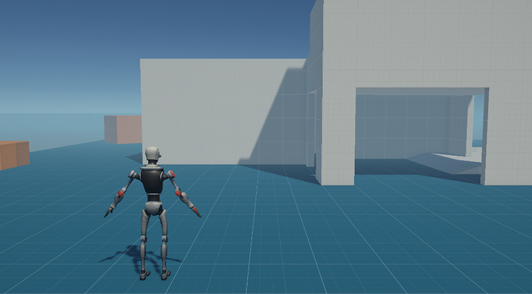
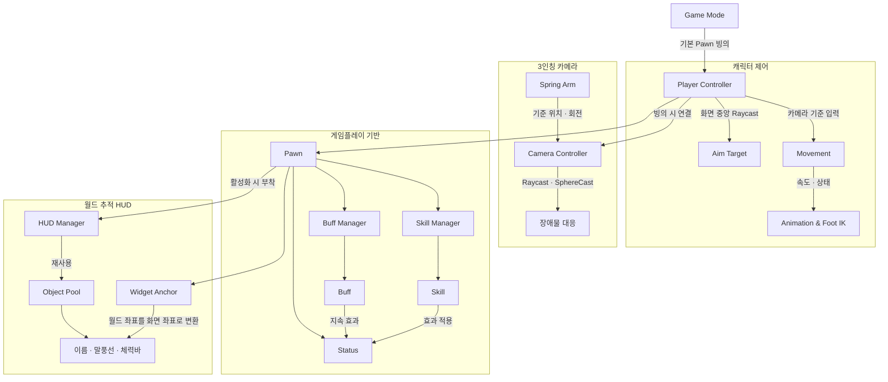

# DJ Unity Framework

**게임 개발에 필요한 기능을 직접 만들고 쌓아가는 개인용 Unity 프레임워크**

## 소개

프로젝트를 시작할 때 반복해서 사용하는 기능과 구조를 정리하고,  
직접 구현하며 학습한 내용을 하나의 재사용 가능한 기반으로 만드는 프로젝트입니다.

개인 프로젝트의 기반으로 사용하는 동시에 **샘플 코드 제출 및 기술 검토 자료**로도 활용합니다.  
완성된 하나의 게임을 제공하는 저장소가 아니라, 기능별 구현과 설계 방식을 보여주는 데 목적이 있습니다.

기존 Unity 개발 경험을 통해 정립한 주요 패턴에 Unreal Engine의 장점을 접목해 개발하고 있습니다.

## 목표

- 자주 사용하는 시스템을 모듈화하여 재사용하기
- 새로운 기능을 자유롭게 실험하고 검증하기
- 나만의 개발 방식과 코드 스타일을 꾸준히 정리하기
- 실제 프로젝트에 빠르게 적용할 수 있는 기반 만들기

## 프레임워크 구조

`GameMode`가 기본 `Pawn`을 빙의시키면 `PlayerController`가 이동, 조준, 카메라를 연결합니다. `Pawn`은 스킬·버프·스테이터스를 소유하고, HUD는 월드 오브젝트를 추적하며 오브젝트 풀을 통해 재사용됩니다.

## 개발된 기능

### 캐릭터 및 플레이어 제어

- Pawn 빙의 및 빙의 해제 — [PlayerController.cs](Assets/Scripts/InGame/Object/PlayerController.cs), [Pawn.cs](Assets/Scripts/InGame/Object/Pawn/Pawn.cs)
- 카메라 방향을 기준으로 한 이동과 달리기, 점프 — [PlayerController.cs](Assets/Scripts/InGame/Object/PlayerController.cs), [Movement.cs](Assets/Scripts/InGame/Object/Pawn/Movement.cs)
- 지면 및 경사면 판정, 코요테 타임 처리 — [Movement.cs](Assets/Scripts/InGame/Object/Pawn/Movement.cs)
- 이동 상태에 따른 캐릭터 회전과 애니메이션 파라미터 갱신 — [Movement.cs](Assets/Scripts/InGame/Object/Pawn/Movement.cs), [CharacterAnimationController.cs](Assets/Scripts/InGame/Object/Pawn/Character/CharacterAnimationController.cs)
- 화면 중앙 Raycast를 이용한 에임 타겟 및 Aim Rig 가중치 제어 — [PlayerController.cs](Assets/Scripts/InGame/Object/PlayerController.cs), [AimTarget.cs](Assets/Scripts/InGame/Object/Pawn/Character/AimTarget.cs)

### 카메라

- Spring Arm 기반 3인칭 카메라 위치 및 회전 설정 — [SpringArm.cs](Assets/Scripts/Common/SpringArm.cs), [PlayerCameraController.cs](Assets/Scripts/Common/PlayerCameraController.cs)
- 마우스 입력을 이용한 Yaw/Pitch 궤도 회전 — [PlayerCameraController.cs](Assets/Scripts/Common/PlayerCameraController.cs)
- Raycast와 SphereCast를 이용한 카메라 장애물 충돌 처리 — [PlayerCameraController.cs](Assets/Scripts/Common/PlayerCameraController.cs)
- 장애물 진입 시 즉시 축소하고 이탈 시 부드럽게 원래 거리로 복귀 — [PlayerCameraController.cs](Assets/Scripts/Common/PlayerCameraController.cs)

### 애니메이션 및 Foot IK

- 이동 속도와 방향을 이용한 애니메이션 블렌드 값 갱신 — [CharacterAnimationController.cs](Assets/Scripts/InGame/Object/Pawn/Character/CharacterAnimationController.cs)
- 정지 상태에서 양발의 지면 위치와 경사를 반영하는 Foot IK — [CharacterAnimationController.FootIK.cs](Assets/Scripts/InGame/Object/Pawn/Character/CharacterAnimationController.FootIK.cs)
- 발의 높이 차이에 따른 캐릭터 몸체 높이 보정 — [CharacterAnimationController.FootIK.cs](Assets/Scripts/InGame/Object/Pawn/Character/CharacterAnimationController.FootIK.cs)

### HUD

- 월드 오브젝트를 화면 좌표로 변환하여 추적하는 HUD — [FollowHUD.cs](Assets/Scripts/UI/HUD/FollowHUD.cs)
- 이름표와 말풍선 HUD 부착 및 해제 — [HUDManager.cs](Assets/Scripts/UI/HUD/HUDManager.cs), [FollowName.cs](Assets/Scripts/UI/HUD/FollowName.cs), [FollowSpeechBubble.cs](Assets/Scripts/UI/HUD/FollowSpeechBubble.cs)
- 오브젝트 풀을 이용한 추적 HUD 재사용 — [HUDManager.cs](Assets/Scripts/UI/HUD/HUDManager.cs), [ObjectPool.cs](Assets/Scripts/Utils/ObjectPool.cs)
- 씬 뷰에서 HUD 앵커 위치 및 이름 표시 — [WidgetAnchor.cs](Assets/Scripts/UI/HUD/WidgetAnchor.cs)

### 게임플레이 기반 구조

- Pawn을 기준으로 한 스킬 및 버프 관리 구조 — [Pawn.cs](Assets/Scripts/InGame/Object/Pawn/Pawn.cs), [SkillManager.cs](Assets/Scripts/InGame/Skill/SkillManager.cs), [BuffManager.cs](Assets/Scripts/InGame/Buff/BuffManager.cs)
- 스킬 실행과 지속형 버프 갱신을 위한 확장 클래스 — [Skill.cs](Assets/Scripts/InGame/Skill/Skill.cs), [Buff.cs](Assets/Scripts/InGame/Buff/Buff.cs)
- 스테이터스 조합을 위한 덧셈 및 뺄셈 연산자 — [Status.cs](Assets/Scripts/InGame/Status/Status.cs)
- Game Mode를 통한 기본 Pawn 자동 빙의 — [GameMode.cs](Assets/Scripts/Management/GameMode.cs)

### 공통 유틸리티 및 에디터 도구

- MonoBehaviour 및 일반 클래스용 싱글톤 — [SingletonBehaviour.cs](Assets/Scripts/Utils/SingletonBehaviour.cs), [Singleton.cs](Assets/Scripts/Utils/Singleton.cs)
- 동적 생성과 미사용 오브젝트 정리를 지원하는 오브젝트 풀 — [ObjectPool.cs](Assets/Scripts/Utils/ObjectPool.cs)
- Coroutine Yield Instruction 캐시 — [YieldInstructionCache.cs](Assets/Scripts/Utils/YieldInstructionCache.cs)
- 카메라, 레이어, 확률, 씬 오브젝트 검색 관련 유틸리티 — [Utils.cs](Assets/Scripts/Utils/Utils.cs)
- 인스펙터 읽기 전용 및 표시 이름 변경 어트리뷰트 — [ReadOnlyAttribute.cs](Assets/Scripts/Etc/ReadOnlyAttribute.cs), [DisplayNameAttribute.cs](Assets/Scripts/Etc/DisplayNameAttribute.cs)
- 씬 뷰에서 Spring Arm 카메라 위치와 회전을 편집하는 핸들 — [SpringArmEditor.cs](Assets/Scripts/Common/Editor/SpringArmEditor.cs)
- 에디터 테스트용 Pawn 빙의 단축키 — [EditorPossessInput.cs](Assets/Scripts/Common/EditorPossessInput.cs)
- 지면 크기에 맞춘 머티리얼 텍스처 타일링 — [GroundTiling.cs](Assets/Scripts/Common/GroundTiling.cs)

## 라이선스

직접 작성한 코드는 [MIT License](LICENSE)에 따라 사용할 수 있습니다.  
Unity 패키지와 서드파티 에셋에는 각 제작자가 정한 별도의 라이선스가 적용됩니다.

## 프로젝트 환경

- **Unity:** 6000.0.83f1

---

> 개인 프레임워크이자 코드 샘플 모음으로, 필요한 기능을 독립적으로 구현하고 지속적으로 개선합니다.
