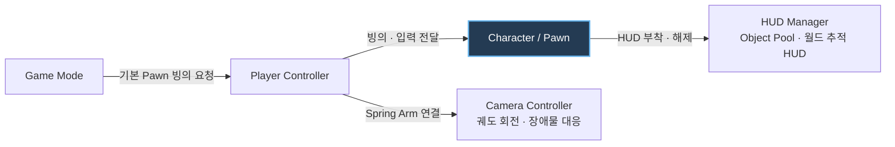
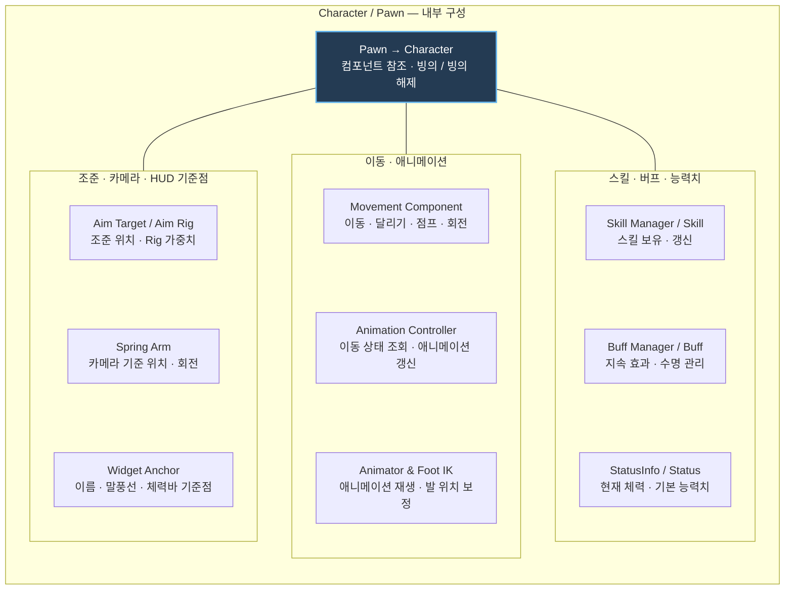

# DJ Unity Framework

**게임 개발에 필요한 기능을 직접 만들고 쌓아가는 개인용 Unity 프레임워크**

## 소개

프로젝트를 시작할 때 반복해서 사용하는 기능과 구조를 정리하고,  
직접 구현하며 학습한 내용을 하나의 재사용 가능한 기반으로 만드는 프로젝트입니다.

개인 프로젝트의 기반으로 사용하는 동시에 **샘플 코드 제출 및 기술 검토 자료**로도 활용합니다.  
완성된 하나의 게임을 제공하는 저장소가 아니라, 기능별 구현과 설계 방식을 보여주는 데 목적이 있습니다.

기존 Unity 개발 경험을 통해 정립한 주요 패턴에 Unreal Engine의 장점을 접목해 개발하고 있습니다.

## 목표

- 자주 사용하는 시스템을 모듈화하여 재사용하기
- 새로운 기능을 자유롭게 실험하고 검증하기
- 나만의 개발 방식과 코드 스타일을 꾸준히 정리하기
- 실제 프로젝트에 빠르게 적용할 수 있는 기반 만들기

## 프레임워크 구조

전체 연결과 캐릭터 내부 구성을 나누어 표시합니다. 전체 연결도에는 시스템 사이의 주요 연결만, 캐릭터 상세도에는 보유하거나 참조하는 구성 요소를 나열합니다.

### 전체 연결

### 캐릭터 내부 구성

`Pawn`을 상속하는 `Character`를 기준으로 묶었습니다. 아래 박스의 배치는 실행 순서가 아니라 기능별 구성 목록입니다.

`GameMode`가 기본 `Pawn`의 빙의를 요청하면 `PlayerController`가 이동 입력, 조준 대상과 카메라를 연결합니다. 카메라는 캐릭터 하위의 `SpringArm`을 기준으로 움직이며, HUD는 `WidgetAnchor`를 추적하고 오브젝트 풀을 통해 재사용됩니다.

## 개발된 기능

### 캐릭터 구성 및 플레이어 제어

캐릭터는 `Pawn`을 중심으로 필요한 기능을 독립된 컴포넌트로 구성하며, `PlayerController`가 캐릭터를 빙의해 입력을 전달합니다.

- **Character / Pawn** — 이동·애니메이션 컴포넌트를 연결하고 스킬·버프·스테이터스를 관리하는 캐릭터 본체 — [Pawn.cs](Assets/Scripts/InGame/Object/Pawn/Pawn.cs), [Character.cs](Assets/Scripts/InGame/Object/Pawn/Character/Character.cs)
- **Skill / Buff / Status** — 캐릭터가 소유하는 스킬, 지속 효과와 능력치 관리 구조 — [SkillManager.cs](Assets/Scripts/InGame/Skill/SkillManager.cs), [BuffManager.cs](Assets/Scripts/InGame/Buff/BuffManager.cs), [Status.cs](Assets/Scripts/InGame/Status/Status.cs)
- **Movement Component** — 카메라 기준 이동, 달리기, 점프, 회전과 지면·경사면 판정 처리 — [Movement.cs](Assets/Scripts/InGame/Object/Pawn/Movement.cs)
- **Animation Controller** — 이동 상태에 따른 애니메이션 갱신과 Foot IK 보정 — [CharacterAnimationController.cs](Assets/Scripts/InGame/Object/Pawn/Character/CharacterAnimationController.cs), [CharacterAnimationController.FootIK.cs](Assets/Scripts/InGame/Object/Pawn/Character/CharacterAnimationController.FootIK.cs)
- **Aim Target** — 화면 중앙 Raycast를 이용한 조준 위치와 Aim Rig 가중치 갱신 — [PlayerController.cs](Assets/Scripts/InGame/Object/PlayerController.cs), [AimTarget.cs](Assets/Scripts/InGame/Object/Pawn/Character/AimTarget.cs)
- **Spring Arm / Camera Controller** — 캐릭터별 카메라 기준점, 궤도 회전과 장애물 충돌 처리 — [SpringArm.cs](Assets/Scripts/Common/SpringArm.cs), [PlayerCameraController.cs](Assets/Scripts/Common/PlayerCameraController.cs)
- **Possession** — Game Mode의 기본 캐릭터 자동 빙의 및 빙의 해제 — [GameMode.cs](Assets/Scripts/Management/GameMode.cs), [PlayerController.cs](Assets/Scripts/InGame/Object/PlayerController.cs)

### HUD

- 월드 오브젝트를 화면 좌표로 변환하여 추적하는 HUD — [FollowHUD.cs](Assets/Scripts/UI/HUD/FollowHUD.cs)
- 이름표와 말풍선 HUD 부착 및 해제 — [HUDManager.cs](Assets/Scripts/UI/HUD/HUDManager.cs), [FollowName.cs](Assets/Scripts/UI/HUD/FollowName.cs), [FollowSpeechBubble.cs](Assets/Scripts/UI/HUD/FollowSpeechBubble.cs)
- 오브젝트 풀을 이용한 추적 HUD 재사용 — [HUDManager.cs](Assets/Scripts/UI/HUD/HUDManager.cs), [ObjectPool.cs](Assets/Scripts/Utils/ObjectPool.cs)
- 씬 뷰에서 HUD 앵커 위치 및 이름 표시 — [WidgetAnchor.cs](Assets/Scripts/UI/HUD/WidgetAnchor.cs)

### 공통 유틸리티 및 에디터 도구

- MonoBehaviour 및 일반 클래스용 싱글톤 — [SingletonBehaviour.cs](Assets/Scripts/Utils/SingletonBehaviour.cs), [Singleton.cs](Assets/Scripts/Utils/Singleton.cs)
- 동적 생성과 미사용 오브젝트 정리를 지원하는 오브젝트 풀 — [ObjectPool.cs](Assets/Scripts/Utils/ObjectPool.cs)
- Coroutine Yield Instruction 캐시 — [YieldInstructionCache.cs](Assets/Scripts/Utils/YieldInstructionCache.cs)
- 카메라, 레이어, 확률, 씬 오브젝트 검색 관련 유틸리티 — [Utils.cs](Assets/Scripts/Utils/Utils.cs)
- 인스펙터 읽기 전용 및 표시 이름 변경 어트리뷰트 — [ReadOnlyAttribute.cs](Assets/Scripts/Etc/ReadOnlyAttribute.cs), [DisplayNameAttribute.cs](Assets/Scripts/Etc/DisplayNameAttribute.cs)
- 씬 뷰에서 Spring Arm 카메라 위치와 회전을 편집하는 핸들 — [SpringArmEditor.cs](Assets/Scripts/Common/Editor/SpringArmEditor.cs)
- 에디터 테스트용 캐릭터(`Pawn`) 빙의 단축키 — [EditorPossessInput.cs](Assets/Scripts/Common/EditorPossessInput.cs)
- 지면 크기에 맞춘 머티리얼 텍스처 타일링 — [GroundTiling.cs](Assets/Scripts/Common/GroundTiling.cs)

## 라이선스

직접 작성한 코드는 [MIT License](LICENSE)에 따라 사용할 수 있습니다.  
Unity 패키지와 서드파티 에셋에는 각 제작자가 정한 별도의 라이선스가 적용됩니다.

## 프로젝트 환경

- **Unity:** 6000.0.83f1

---

> 개인 프레임워크이자 코드 샘플 모음으로, 필요한 기능을 독립적으로 구현하고 지속적으로 개선합니다.
